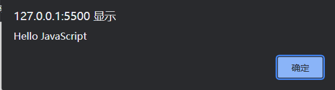
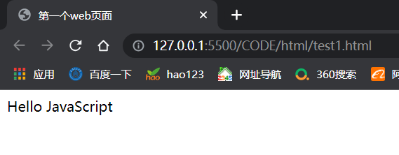
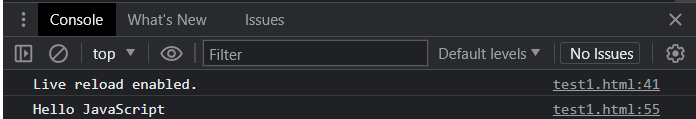
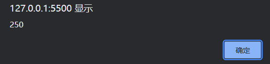
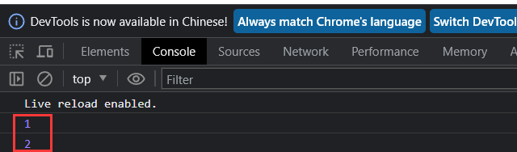
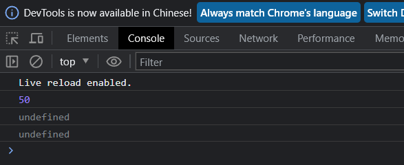
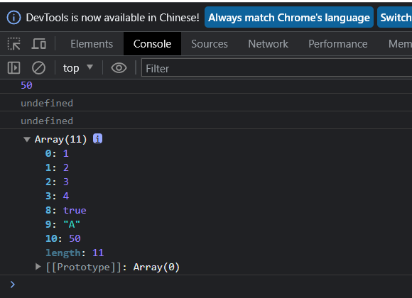
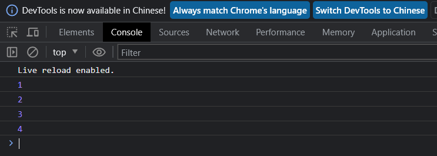
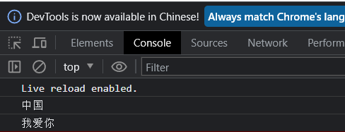
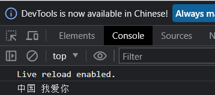

#前言
  众所周知，JavaScript不管是在前端还是后端都被广泛运用，运行JavaScript有多种方式，可以直接在浏览器的控制台编写运行；也可以编写一个独立的js文件，在html文件中引入。也可以用编辑软件如Webstrom或VSCode编写独立的js文件，由安装好的Node.js解释执行运行，本人一般使用第二种。TypeScript是微软开发的一个开源的编程语言，现今也得到了广泛应用，ts完全兼容javascript，它可以编译成javascript。
##一.JavaScript
JavaScript是一门跨平台、面向对象的脚本语言。是用来控制网页行为的，它能使网页可交互。
####1.基本语法

######标识符
- 标识符指变量、函数、属性的名字，或者函数的参数
######语句与注释
- JavaScript程序的执行单位为行，即一行一行地执行，一行结束可以用分号，也可以什么都不加，如果加了分号，JavaScript引擎就将表达式视为语句，这样会产生一些没有任何意义的语句。一般情况下，每一行就是一个语句。
- 注释分为单行注释和多行注释：
  单行注释:/注释内容；多行注释:`/*注释内容*/` 
- 大括号表示代码块,例如：
```
//判断
if(count == 0){
  alert(count);
}
```

- 输出语句有三种方式：
  使用window.alert()写入警告框；使用document.write()写入HTML输出；使用console.log()写入浏览器控制台
```
<script>
window.alert("Hello JavaScript");//浏览器弹出警告框
document.write("Hello JavaScript");//写入HTML,在浏览器展示
console.log("Hello JavaScript"); //写入浏览器控制台
</script>
```
   &nbsp;&nbsp;&nbsp;&nbsp;&nbsp;&nbsp;&nbsp;&nbsp;效果分别为：</br>
<center>
    
</center></br>
<center>
    
</center></br>
<center>
    
</center></br>

######变量
JavaScript中用var关键字来声明变量，JavaScript是一门弱类型语言，变量可以存放不同类型的值，变量名需要遵循如下规则：组成字符可以是任何字母、数字、下划线(_）或美元符号($)，数字不能开头，例如：
```
var a=250;
a="张三";
```
var特点：1.作用域比较大，相对于全局变量，例如：
```
<script>
  {
    var a=250;
  }
  alert(a);
</script>
```
效果为：</br>
<center>
    
</center></br>
2.可以重复定义的，变量将会按照最后一个值进行操作，例如：
```
<script>
  {
    var a=250;
    var a="x";
  }
  alert(a);
</script>
```
######数据类型、运算符、流程控制语句
JavaScript中数据类型分为︰原始类型和引用类型。包括String、Number、Boolean、Null、undefine以及Object等数据。使用typeof运算符可以获取数据类型，例如：
```
alert(typeof 3);// number
alert(typeof 3.14);//number

alert (typeof "A");//string
alert (typeof 'Hello' ) ;//string

alert(typeof true) ;// boolean
alert(typeof false) ; //boolean

alert (typeof null) ;//object(一个对象)

var a ;
alert (typeof a) ; //undefined
```
######运算符
```
算术运算符:+，-，*，/，%，++,--</br>
赋值运算符:=，+= , -= ，*=，/=，%=</br>
比较运算符: > ,<, >= ，<= , != , ==,===</br>
逻辑运算符:&&，||，!</br>
三元运算符:条件表达式? true_value: false_value</br>
注意：==会进行类型转换，===不会进行类型转换
```

######流程控制语句
```
if...else if ...else...
switch
for
while
do ... while
```
####2.js函数
介绍:函数（方法）是被设计为执行特定任务的代码块。</br>
定义:JavaScript函数通过function关键字进行定义，也可以用var定义，语法为:
```
定义一 ：
function functionName(参数1,参数2..){
  //要执行的代码
}
定义二：
var functionName(参数1,参数2..){
  //要执行的代码
}
```

例如：
```
function add(a,b){
  return a+b;
}
```

注意:形式参数不需要类型。因为JavaScript是弱类型语言;返回值也不需要定义类型，可以在函数内部直接使用return返回即可;</br></br>
调用:函数名称(实际参数列表)，例如：

```
var result = add(10,20);//JS中，函数调用可以传递任意个数的参数。
alert(result)
```
####2.js对象
```
Array
String
JSON
BOM//浏览器对象模型，把浏览器封装成对象
DOM//文档对象模型
```
######Array数组对象
JavaScript 中 Array对象用于定义数组。</br>
定义：</br>
```
var 变量名= new Array(元素列表);//方式一
var arr = new Array( 1,2,3,4);

var 变量名=[元素列表];/l方式二
var arr = [1,2,3,4];
```
访问：
```
arr[索引]=值;
arr[10] = "hello";
```
例子：
```
//var arr = new Array (1,2,3,4) ;
var arr=[ 1,2，3，4 ];
console.log ( arr [ 0] );
console.log (arr [ 1]);
```
效果为：</br>
<center>
    
</center></br>
js数组特点:长度可变，类型可变，例如：
```
//js数组长度可变
var arr = [ 1,2,3，4];
arr [ 10] = 50 ;
console .log ( arr [ 10] ) ;
console.log (arr [9]);//未定义数据类型，所以为undefined
console. log ( arr[8]);//未定义数据类型，所以为undefined
```
效果为：</br>
<center>
    
</center></br>
```
//js数组类型可变
var arr = [ 1,2,3,4];
arr [ 10] = 50 ;
console .log ( arr [ 10] ) ;
console.log (arr [9]);//未定义数据类型，所以为undefined
console. log ( arr[8]);//未定义数据类型，所以为undefined
arr[ 9]="A";
arr [8]= true;
console .log (arr);
```
效果为：</br>
<center>
    
</center></br>
array属性和方法：
```
//属性
length:设置或返回数组中元素的数量
//方法
forEach():遍历数组中的每个有值的元素，并调用一次传入的函数
push():将新元素添加到数组的末尾，并返回新的长度
splice():从数组中删除元素
```
例如：
```
法一：
var arr =[ 1,2,3,4];
//forEach:遍历数组中有值的元素
arr.forEach (function (e) {
  console.log (e) ;
} )

法二：
//ES6箭头函数: (...) => { ...}  简化函数定义
arr.forEach ((e)=> {
console.log (e) ;
})
```
效果为：</br>
<center>
    
</center></br>
######链式语法
因为 jQuery 库，链式语法在前端界变得非常流行，只需要让每个函数返回 'this'，这样其他函数就可以立即被调用。例如：
```
var bird = {
    catapult: function() {
        console.log( "中国" );
        return this;//返回bird对象自身
    },
    destroy: function() {
        console.log( "我爱你" );
        return this;
    }
};
bird.catapult().destroy();
```
效果为：</br>
<center>
    
</center></br>
######闭包
当在一个函数内定义另外一个函数就会产生闭包。如下代码：
```
function greeting(name) {
    var text = '中国 ' + name; 
    // 每次调用时，产生闭包，并返回内部函数对象给调用者
    return function() { console.log(text); }//注意该函数无名称，称为匿名函数
}
var sayHello = greeting('Closure');
sayHello();  // 注意此处的使用方法。通过闭包访问到了局部变量text
bird.catapult().destroy();
```
效果为：</br>
<center>
    
</center></br>
##一.TypeScript
TypeScript是微软开发的一个开源的编程语言，通过在JavaScript的基础上添加静态类型定义构建而成。TypeScript通过TypeScript编译器或Babel转译为JavaScript代码，可运行在任何浏览器以及任何操作系统。
##### TypeScript基础语法
######1.let 和 const
不使用var，使用let或const申明变量，并加上类型说明，且作用域为块级即以{}为界
######2.TS的类型
```
原始类型：number/string/boolean/null/undefined/symbol
特点：简单，这些类型与JS 中类型的名称采用相同的形式

let age: number = 18  //数值类型
let myName: string = '化学家'  //字符串类型
let isLoading: boolean = false  //布尔类型
let un: undefined = undefined  //undefined
let timer:null = null  //null
```
######3.解构
将对象、数组中的元素拆分到指定变量中，以方便使用
######4.函数
例如：
```
// 函数定义
function greet():string { // 返回一个字符串
    return "cqjtu college" 
} 
 
function caller() { 
    var msg = greet() // 调用 greet() 函数 
    console.log(msg) 
} 
 
// 调用函数
caller()
```
######5.Map对象 
Map 对象保存键值对，并且能够记住键的原始插入顺序。
任何值(对象或者原始值) 都可以作为一个键或一个值。
######6.模块Module
对于大型的项目，我们需要使用模块进行管理。每个 .ts 文件就是一个模块，通过 export 来对外部模块暴露元素，通过 import 来引入模块。